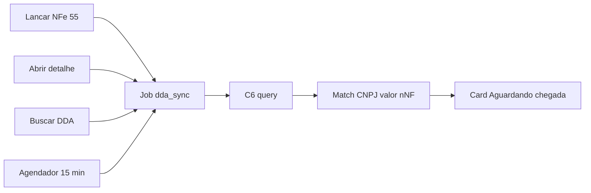

# Handoff — DDA C6 × ERP

**Data:** 27/08/2026  
**Versão do sistema no momento deste handoff:** 1.12.0 — DDA  
**Objetivo:** retomar a integração depois (certificado mTLS + AT_01 / AP_02 + colar JSON no roteiro). **Não** reescrever o módulo do zero.

**Neste arquivo NÃO entram:** Client Secret, certificado PEM (`.crt`), chave privada (`.key`), chave PIX. Só dado da empresa / o que falta.

Arquivos nesta pasta:

| Arquivo | Para quê |
|---------|----------|
| Este (`HANDOFF-C6-DDA.md`) | Memória técnica da equipe |
| [`PEDIDO-CREDENCIAIS-C6-DDA.md`](PEDIDO-CREDENCIAIS-C6-DDA.md) | Texto para o dono da conta (sem Secret) |

---

## 1. Estado atual (honesto)

O módulo **já está no código** (versão **1.12.0 — DDA**): job, card, config, match, migration.

| Camada | Situação |
|--------|----------|
| Código no ERP | Pronto — job `dda_sync`, card na Aguardando chegada, config admin, match, migration Prisma |
| Chamada real ao C6 | **Bloqueada** — falta mTLS (`.crt` + `.key`). Sem isso o ERP **não** chama o banco (fail-closed) |
| Homologação C6 | **Não enviada** — roteiro Word com org + notas; AT_01 e AP_02 ainda PENDENTE |
| Contas a pagar / pagar boleto | **Fora de escopo** nesta fase |
| PDF do boleto DDA | **Incerto** — `B_06` é boleto **emitido**, não comprovado para DDA a pagar |

Este arquivo serve para **retomar** (cert + testes + JSON no Word), não para reescrever o módulo.

---

## 2. Conta e cadastro (o que vocês têm)

| Item | Valor | Situação |
|------|--------|----------|
| Banco | 336 — Banco C6 S.A. | Conferido |
| Agência / conta | 0001 / 43779572-1 | Conferido |
| CNPJ | 34.221.243/0001-71 | Bate com a empresa no ERP |
| Razão | CONEXAO COMERCIAL ATACADISTA DE MATERIAIS DE CONSTRUCAO LTDA | Roteiro |
| E-mail portal | LUCASRODRIGUES4@LIVE.COM | Sandbox |
| Client ID / Secret | E-mail do Developers (sandbox) | Existem; **não vão neste arquivo** |
| Chave PIX sandbox | Veio no mesmo e-mail | **Não usar no DDA** |
| Certificado mTLS `.crt` + `.key` | — | **Falta** — bloqueia AT_01 e qualquer fetch |
| Produção | PJ mesmo CNPJ do portal; MEI não serve | Ainda não |

Integração **direta** (ERP = parceiro). Sem TecnoSpeed. Campo **Parceiro** no Web Banking = vocês depois da homologação no portal Developers — **não** um nome aleatório da lista (JORGE ALBERTO, AOSAFE, etc.).

Detalhe do fluxo “parceiro → chave”: [`PEDIDO-CREDENCIAIS-C6-DDA.md`](PEDIDO-CREDENCIAIS-C6-DDA.md).

---

## 3. Contrato C6 (o que testar depois)

### Auth (AT_01)

- `POST /auth`
- `Content-Type: application/x-www-form-urlencoded`
- Body: `client_id` + `client_secret`
- **mTLS obrigatório**
- Token ~300 s
- Docs: https://developers.c6bank.com.br/apis/auth

### DDA nesta fase (AP_02)

- Só `GET /schedule_payments/query` (boletos pendentes / agenda)
- Escopos: `schedulepayments.read` / `.write`
- Docs: https://developers.c6bank.com.br/apis/schedule-payments

### Fora desta fase

| Tema | Motivo |
|------|--------|
| AP_01 | Decode de grupo — não usamos |
| AP_03–AP_06 | Agendar / pagar boleto — não pagar agora |
| Boleto de cobrança | Outro produto (emitir), não DDA a pagar |
| B_06 PDF de boleto emitido | Não comprovado para DDA |

### Ambientes

| Ambiente | URL default no código | Override |
|----------|----------------------|----------|
| Sandbox | `https://api-sandbox.c6bank.com.br/v1` | `C6_BANK_URL_SANDBOX` |
| Produção | `https://api.c6bank.com.br/v1` | `C6_BANK_URL_PROD` |

Sandbox: tipicamente **seg–sex 7h–23h** (conferir portal). Credenciais de produção são **novas** (não reutilizar as do sandbox).

### Homologação formal

1. Rodar AT_01 e AP_02 de verdade com mTLS.
2. Colar Status Code + body no Word.
3. Enviar para `homologacaoapi@c6bank.com`.

Word já preenchido (org + notas AT_01 / AP_02 / fora de escopo):

- Raiz do ERP: `Roteiro-Testes-C6-Conexao-preenchido-v2.docx`
- Cópia: `Downloads/Roteiro-Testes-C6-Conexao-preenchido-v2.docx`
- Script: [`scripts/preencher-roteiro-c6.py`](../scripts/preencher-roteiro-c6.py)
- Origem oficial C6: Roteiro de Testes — C6 Developers v3.0

---

## 4. O que o ERP já faz (mapa para retomar)

| Peça | Onde / regra |
|------|----------------|
| Config UI | Configurações → Financeiro → **DDA** (admin). Secret/cert **nunca** voltam na API |
| Card | [`frontend/components/dda/card-conferencia-dda.tsx`](../frontend/components/dda/card-conferencia-dda.tsx) — **não** trava Liberar para contagem |
| API | `/dda/config`, `/dda/testar-conexao`, `/dda/jobs/sincronizar`, `/dda/notas/:id/conferencia`, `/dda/boletos/:id/vincular` |
| Cliente | Fila ≥ 800 ms, 429, token cache, mTLS, fail-closed sem cert — [`src/modulos/dda/cliente-c6-bank.ts`](../src/modulos/dda/cliente-c6-bank.ts) |
| Match | 1 candidato = auto; 0 = `sem_nf`; N = `ambiguo`; manual não sobrescreve — [`casar-dda-com-nf.ts`](../src/modulos/dda/casar-dda-com-nf.ts) |
| Models | `ConfiguracaoC6Bank`, `DdaBoleto` — migration `20260827140000_dda_c6_bank` |
| Job | Tipo `dda_sync`, dedupe `sync` por empresa; `C6_DDA_AGENDADOR=false` desliga o tick de ~15 min |
| Parser | [`normalizar-boleto-c6.ts`](../src/modulos/dda/normalizar-boleto-c6.ts) — best-effort até ver o JSON real do AP_02 |

### Regra de match (resumo)

1. CNPJ beneficiário = `documentoEmitente` (só dígitos).
2. Valor = `vDup` (± R$ 0,01); senão `valorTotal` só se 1 parcela.
3. Nº NF se o boleto trouxer (`nNF` / `nDup`).
4. Auto só com **1** candidato → `vinculado`.

### Fora desta fase (produto)

- Pagar boleto no banco
- Gerar Contas a pagar
- PDF DDA
- Travar Liberar para contagem por falta de DDA

### Doc do sistema

Comportamento oficial do ERP: `DOCUMENTACAO-SISTEMA.md` (§6.11c / §7.24 na entrega 1.12.0). Este handoff é memória de integração C6 — **não** substitui a doc do sistema.

---

## 5. Checklist para o futuro (quando o cert chegar)

1. Guardar `.crt` + `.key` + Client ID/Secret em canal privado (**não** commit).
2. Colar PEM em Configurações → Financeiro → **DDA** (sandbox) → Salvar.
3. **Testar conexão** = AT_01 → colar Status Code + body no Word.
4. **Buscar DDA** numa NF em Aguardando chegada = AP_02 → colar JSON.
5. Ajustar `normalizar-boleto-c6.ts` se os nomes dos campos do JSON real forem outros.
6. Conferir: 1 boleto casa sozinho; vários pedem Vincular; Liberar para contagem **não** bloqueia.
7. Enviar roteiro ao C6 (`homologacaoapi@c6bank.com`).
8. Produção = credenciais **novas** (não as do sandbox); desmarcar homologação no painel e smoke test.

### Env úteis

| Variável | Uso |
|----------|-----|
| `C6_DDA_AGENDADOR` | `false` desliga o tick de 15 min |
| `C6_BANK_URL_SANDBOX` / `C6_BANK_URL_PROD` | Override das bases |
| `JOBS_WORKER` | Precisa ativo para o `dda_sync` rodar |

---

## 6. Gaps / riscos

| Gap | Impacto |
|-----|---------|
| Sem mTLS | Nenhuma chamada C6 |
| JSON oficial de `query` ainda não visto | Parser pode precisar ajuste |
| PDF DDA | Não implementado / não comprovado |
| Campo Parceiro errado | Entrega a chave a outro software |

---

## 7. Contatos

| O quê | Onde |
|-------|------|
| Portal Developers | https://developers.c6bank.com.br/ |
| Web Banking | https://www.c6bank.com.br/web-banking/ |
| Homologação API | homologacaoapi@c6bank.com |
| Auth | https://developers.c6bank.com.br/apis/auth |
| Schedule payments | https://developers.c6bank.com.br/apis/schedule-payments |

---

*Próximo passo humano: obter `.crt` + `.key` do sandbox e seguir a seção 5.*
